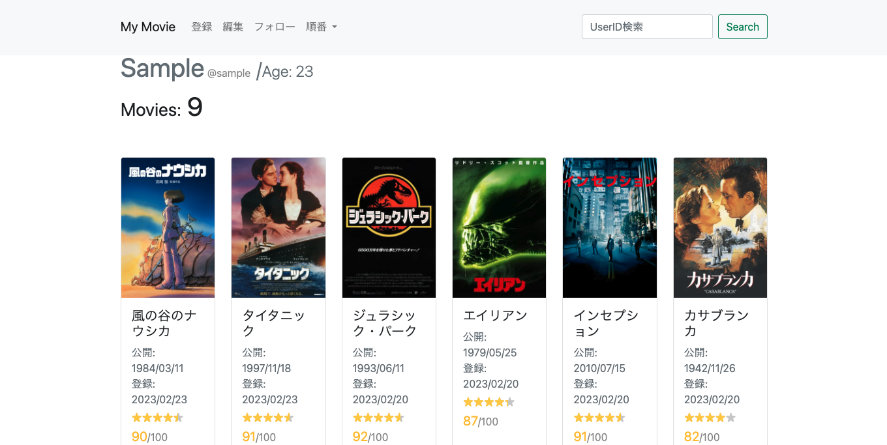

# Overview
本システムは、過去観たことのある映画を点数をつけて管理するWebアプリケーションです。  
登録した映画を登録日、公開日、点数の順に並び替えて一覧表示でき、他のユーザの一覧も閲覧できます。  
それぞれの映画を登録しているユーザ一覧も表示されるので、その映画を観たユーザが他にどのような映画を観ているか、どの映画に高い点数をつけているかをチェックできます。  
レスポンシブ画面にも対応しています。  
 

 

